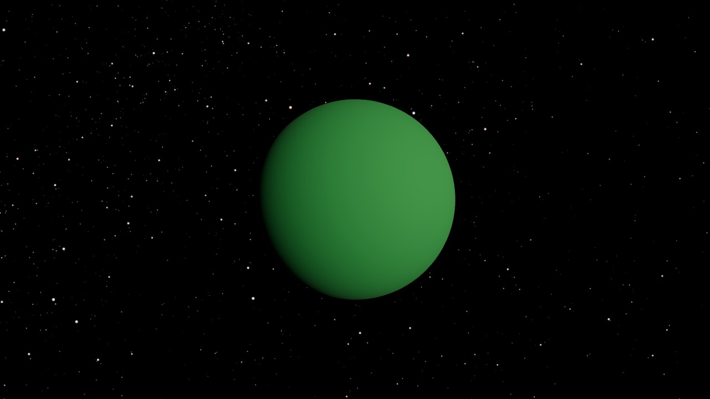
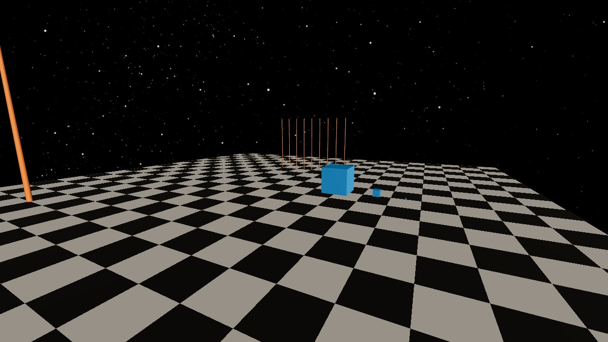

# Progress history

Screenshots taken during development, oldest first. Each one was captured from the running dev
build with `nms.screenshot('name', true)` (see `src/dev/DevTools.ts`) at 1280×720.

## M0 — Scaffold

### 001 — Placeholder planet and starfield

Vite + TypeScript + three.js running. The "planet" is a plain 8 km sphere, lit by a directional
sun; the stars are ~9000 point sprites with a denser band that hints at a galactic plane.

### 002 — Test beacon 500 km from the origin

The camera-relative ("floating origin") test: a 20 m checkerboard platform with 4 cm rods and
5 cm cubes, 500 km from the universe origin. Up close it stays perfectly still — without the
floating origin world-space coordinates would be rounded to a ~3 cm float32 grid out here.
