# Progress history

Screenshots taken during development, oldest first. Each one was captured from the running dev
build with `nms.screenshot('name', true)` (see `src/dev/DevTools.ts`) at 1280×720.

## M0 — Scaffold

### 001 — Placeholder planet and starfield

Vite + TypeScript + three.js running. The "planet" is a plain 8 km sphere, lit by a directional
sun; the stars are ~9000 point sprites with a denser band that hints at a galactic plane.

### 002 — Test beacon 500 km from the origin

The camera-relative ("floating origin") test: a 20 m checkerboard platform with 4 cm rods and
5 cm cubes, 500 km from the universe origin. Up close it stays perfectly still — without the
floating origin world-space coordinates would be rounded to a ~3 cm float32 grid out here.

## M1 — One planet

### 003 — Verdant from orbit

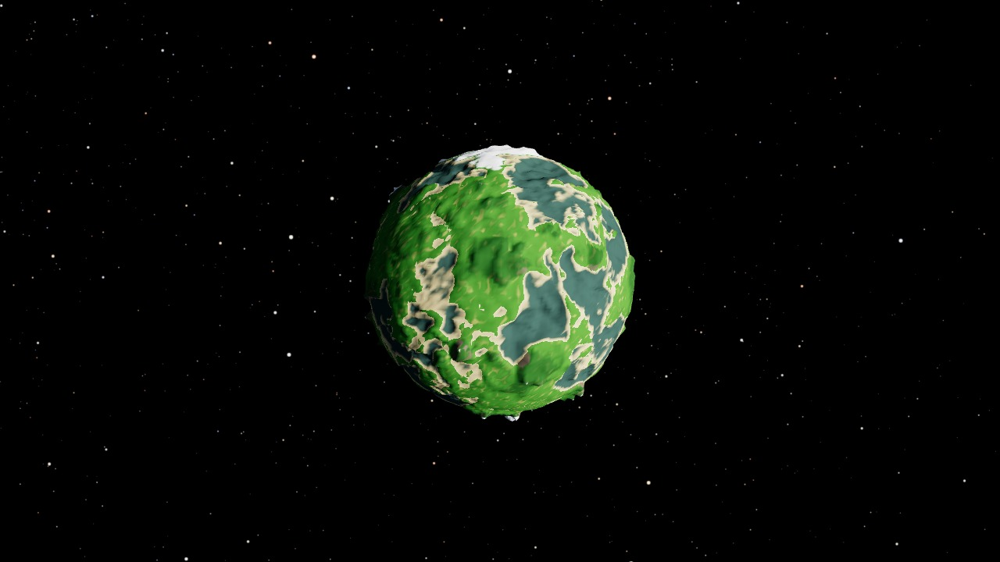

A 10 km planet built from six cube-face quadtrees. Height is domain-warped fBm continents +
rolling hills + ridged-noise mountain ranges; colours are picked per pixel from height, slope
and latitude (beaches, grass, forest, rock, snow, polar caps). The grey-teal basins are the
seabed: there is no water until M2.

### 004 — A mountain range from 400 m

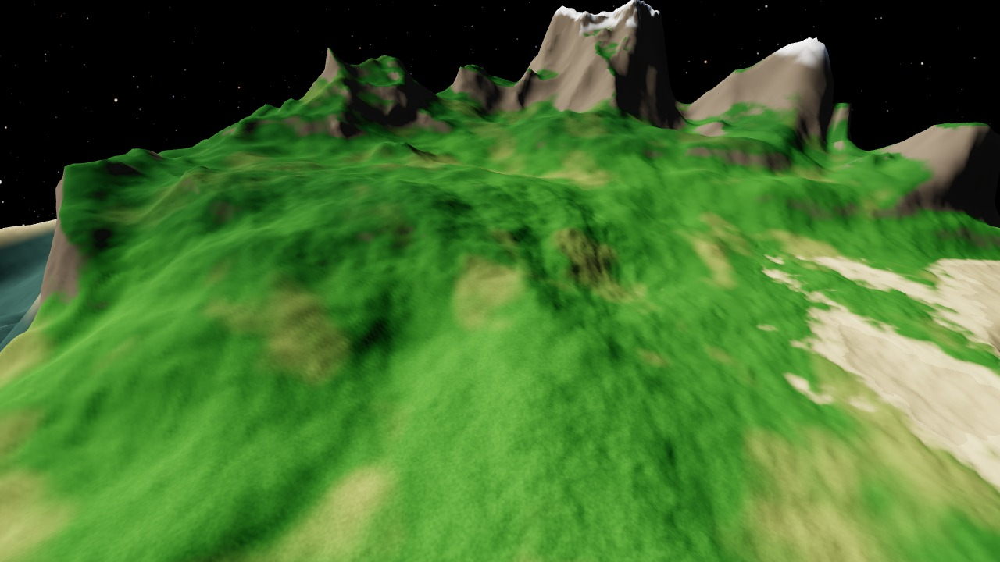

Chunks are generated in a pool of Web Workers and streamed in nearest-first; the view is right
over a cube corner, where three faces (and quadtrees) meet — no seams.

### 005 — Same spot, LOD debug view (F4)

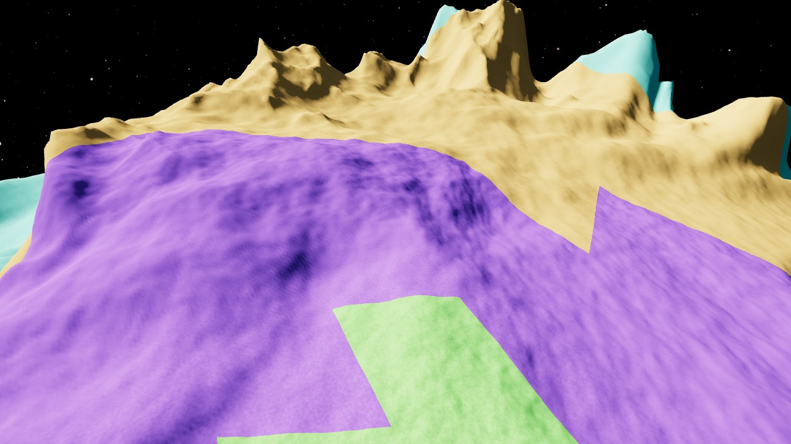

One colour per quadtree level: small, dense chunks near the camera, bigger ones further away.
Where neighbouring levels meet, skirts (strips hanging down from each chunk's border) hide the
cracks.

### 006 — Ground level

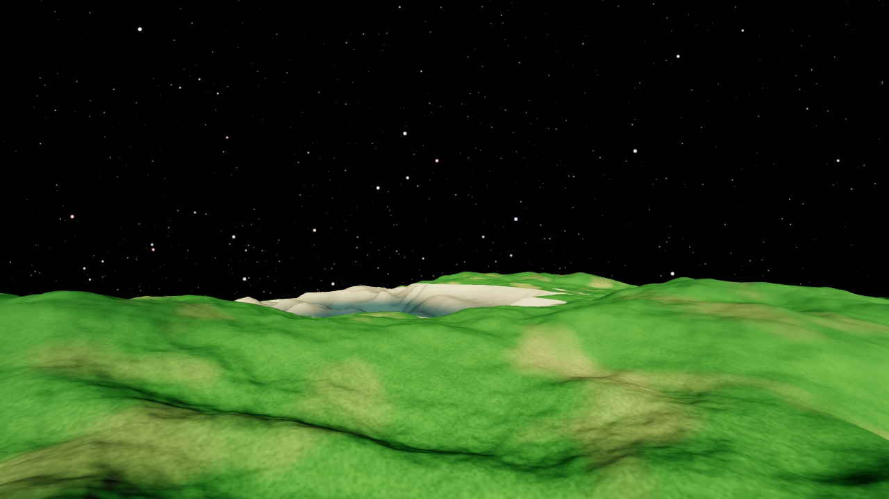

At ground level the finest chunks have ~1 m vertex spacing, and a few octaves of value noise in
the shader give the ground some texture (faded out with distance so it never shimmers).

## M2 — On foot

### 007 — First person at the spawn point

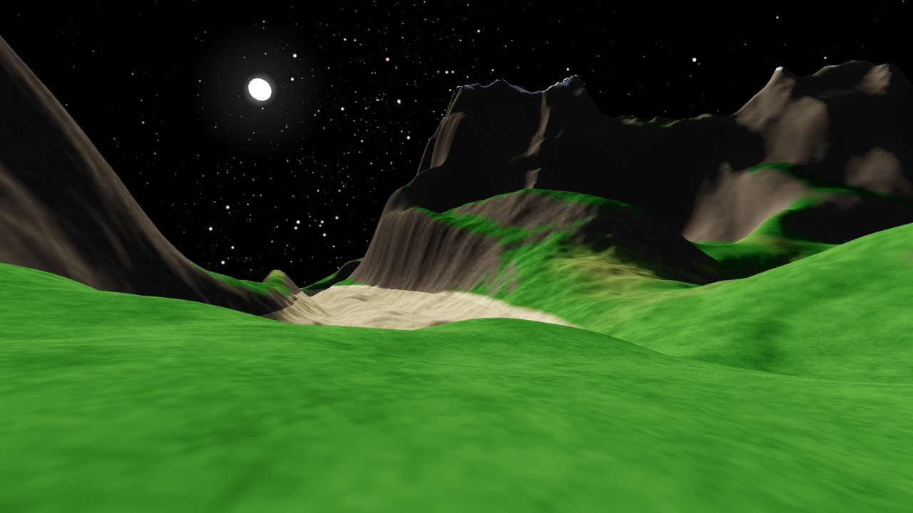

Walking on the planet: spherical gravity, walk / sprint / jump / jetpack, swimming, and analytic
terrain collision against the same height function the workers used to build the mesh. The
planet now spins (15-minute day) around a real star 180 km away, so the sun rises and sets. The
sky is still black: the atmosphere is next.

### 008 — Sky and sea at the spawn point

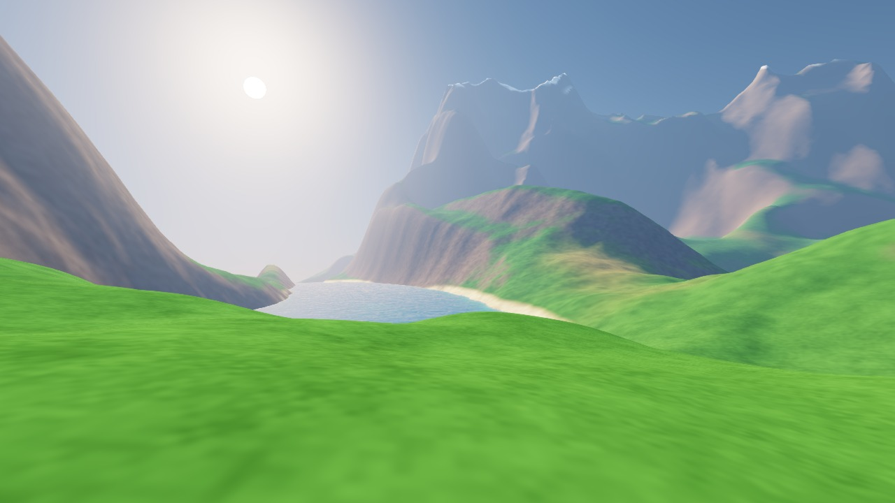

Atmospheric scattering: a full-screen pass ray-marches Rayleigh + Mie single scattering for
every pixel, using the depth buffer to know how far the terrain is — so one piece of code gives
the blue sky, the glow around the sun and the haze that fades the distant mountains. The ocean
lives in the same pass: an exact sea-level sphere intersected per pixel.

### 009 — Shallow water at the beach

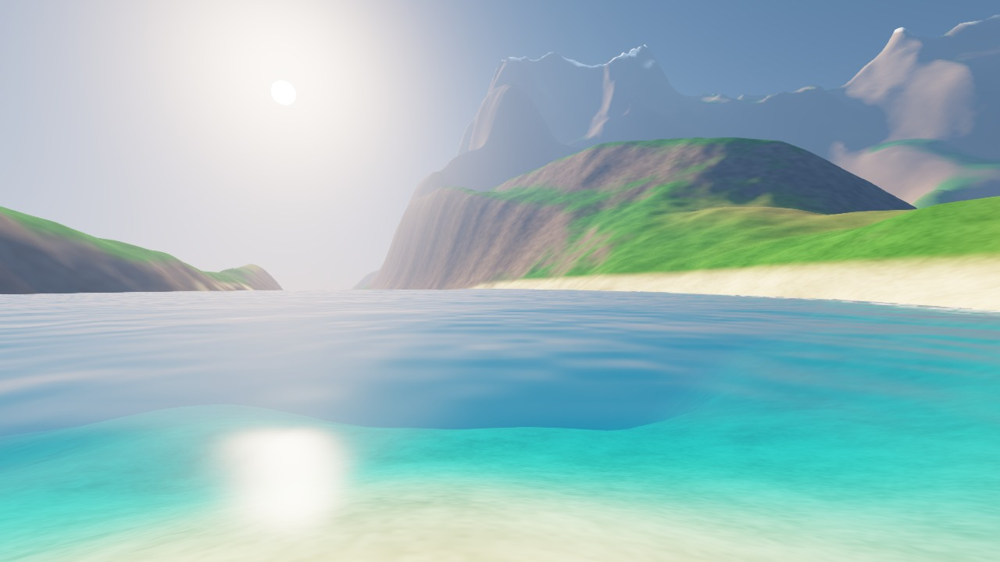

Because the seabed is still in the depth buffer, the shader knows how much water light crosses:
red is absorbed first, so shallow water over sand is turquoise and deep water dark blue.
Reflections of the sky (Fresnel), a sun glint, animated noise waves and foam in the shallows.

### 010 — Sunset over the sea

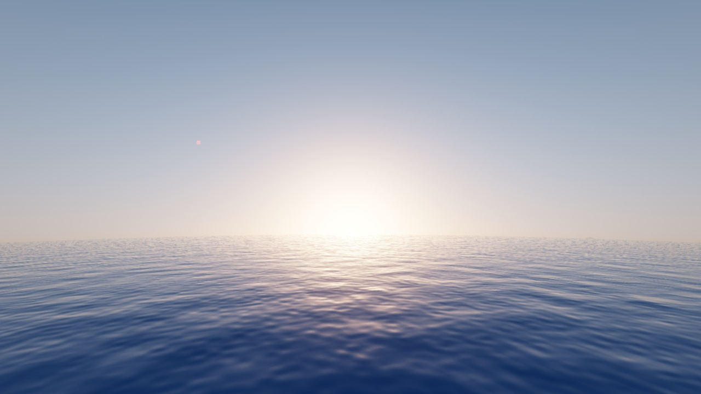

Sunlight reaching the air and the ground has crossed the atmosphere too, so it reddens near the
horizon. An ozone-like absorption term keeps sunsets peach/orange instead of yellow-green.

### 011 — Verdant from orbit, day and night

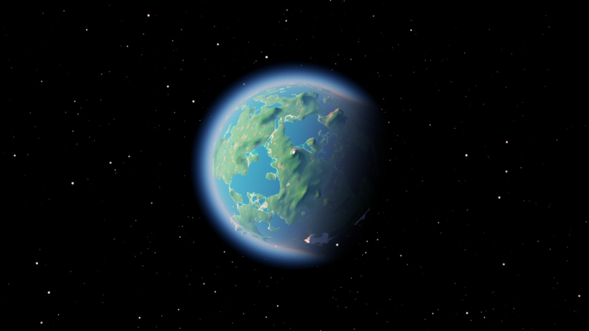

The same shaders seen from space: a glowing rim, a soft terminator (the planet's shadow fades
over a few degrees), oceans, and a night side lit only by starlight.

### 012 — Jetpack view over the bay

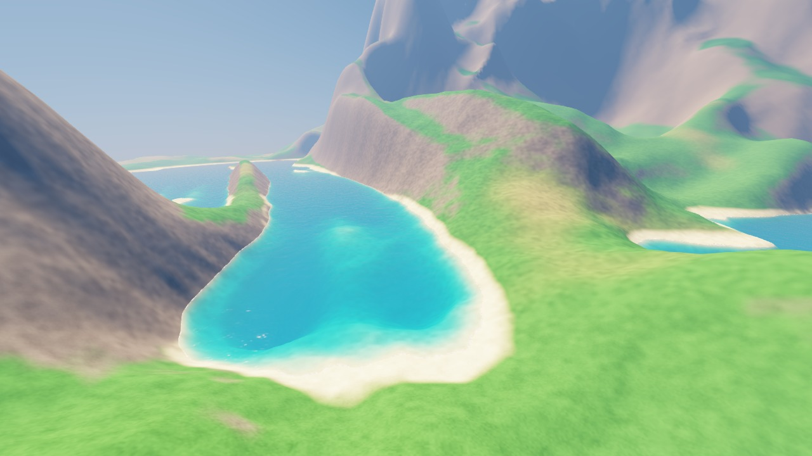

Sixty metres up on the jetpack: the lagoon from above, beaches along the shoreline, haze
softening the far hills.

### 013 — Night at the spawn point

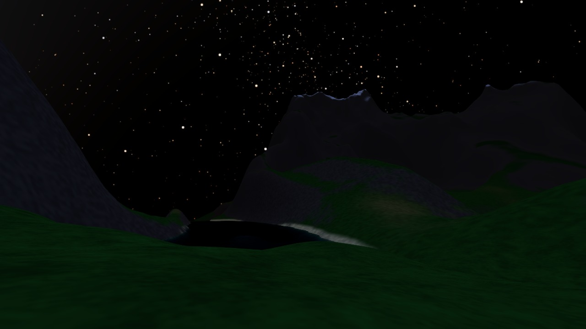

After sunset: the stars come back as the sky darkens, and a simple eye-adaptation raises the
exposure so the starlit landscape stays readable.

## M3 — Solar system

### 014 — Verdant over Lull

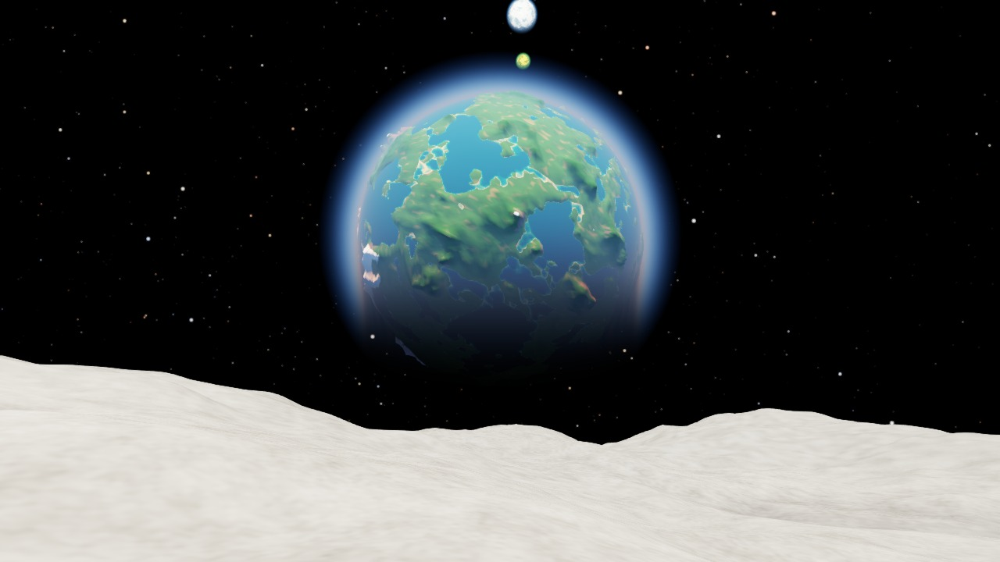

The whole system now exists: a star, four planets and three moons, all from config. Standing on
Lull, Verdant's moon: no air, so the sky is black at noon and shadows are hard. Lull is tidally
locked, so Verdant hangs in the same spot of its sky (bobbing a few degrees because Lull's orbit
is tilted). Rime and its green moon Sulfa are the two dots above.

### 015 — Ember from orbit

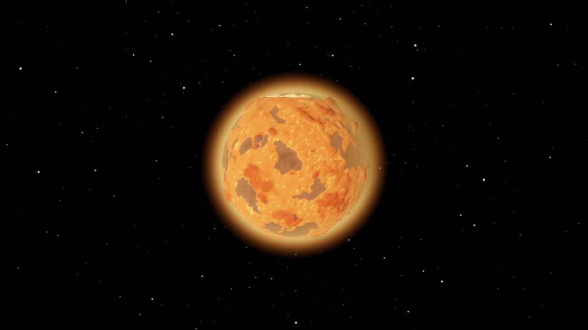

The innermost planet: red dunes and dark basalt lowlands under an orange sky (stylised: its air
scatters red most). Every body is the same terrain generator with its own seed, shape
parameters, palette and air.

### 016 — Sulfa in front of Rime

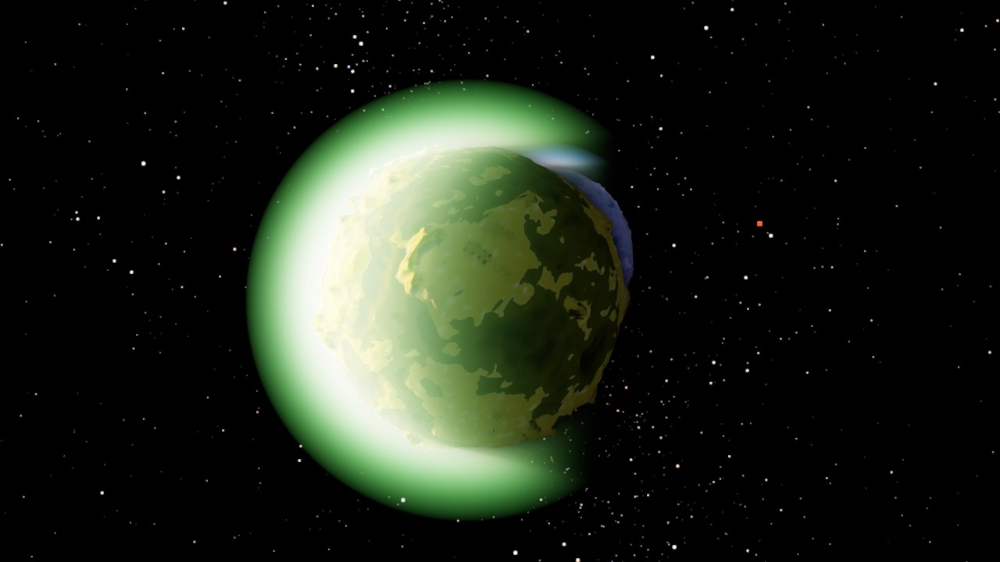

Several atmospheres at once: the composite pass loops over every body's air, farthest first.
Sulfa's toxic green haze glows with the sun behind it (Mie scattering is strongly forwards);
icy Rime is behind.

### 017 — Shard in front of Nyx

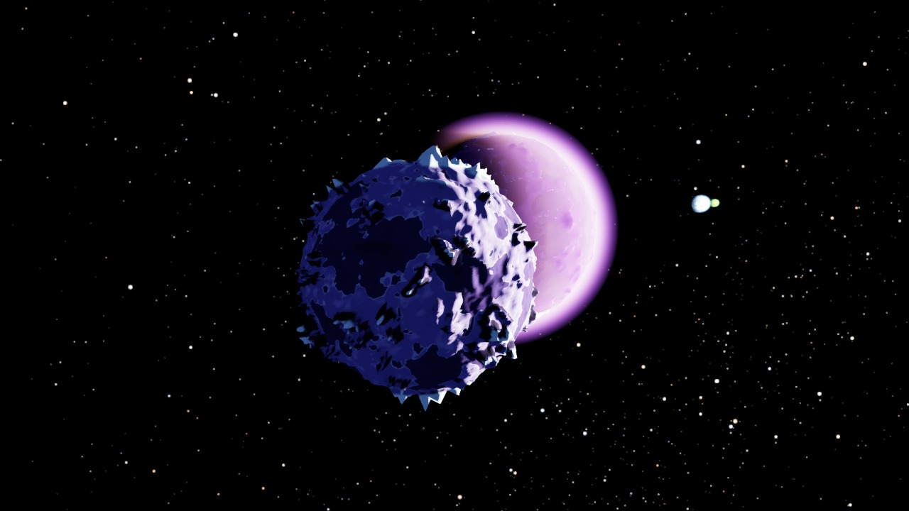

Nyx's tiny jagged moon against the violet crescent of Nyx. All bodies move on rails: circular
orbits that are pure functions of time, parents first, then their moons.

## M4 — Ship

### 018 — The ship, parked by the spawn

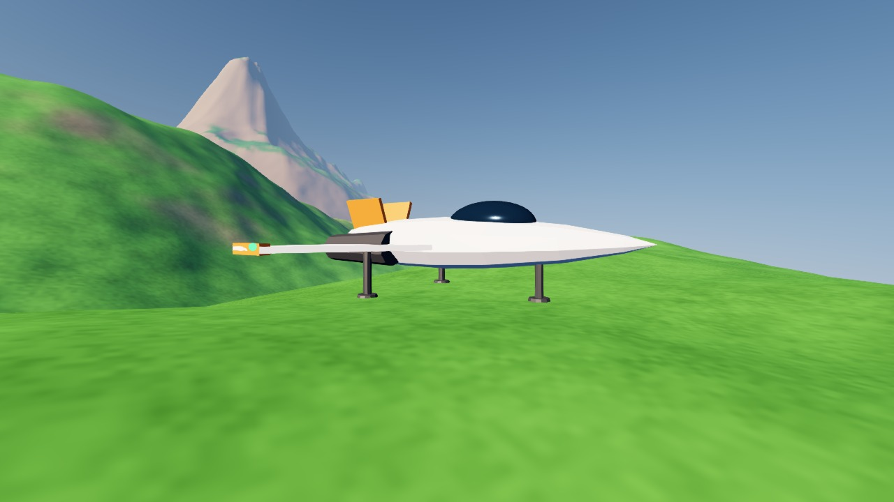

A fighter built from three.js primitives: a faceted lathe fuselage, a glass canopy, extruded
swept wings, two engines and a tripod landing gear. Three legs always stand without wobbling
(three points define a plane), so landing on uneven ground needs no physics. It is lit by
three.js lights set to the same sunlight and sky light the terrain shader computes.

### 019 — Flying over the bay

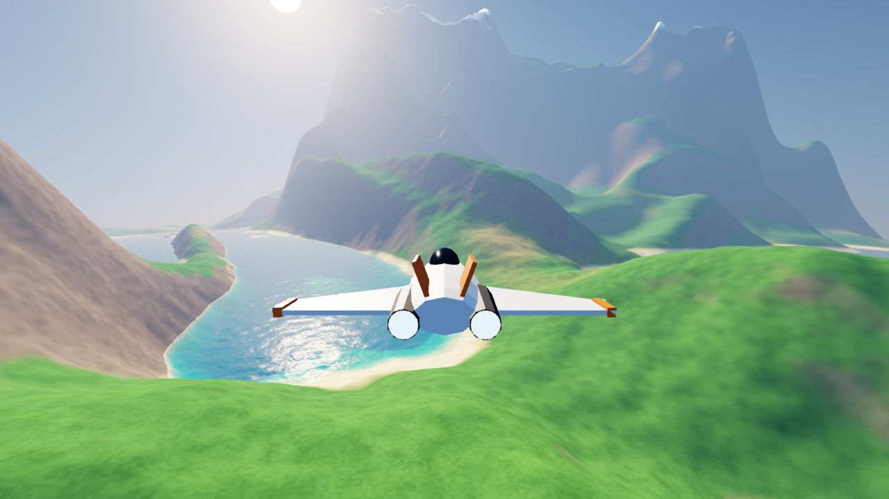

Atmospheric flight at 160 m/s, chase camera. Low down the ship handles like a plane: high
"grip" turns its velocity towards the nose and the wings level themselves. Climbing out of the
air it blends into space handling: faster, drifting, no levelling. Space takes off, E lands on
a spot picked ahead (refused over water or slopes above 30°).

### 020 — Pulse drive from Verdant to Lull

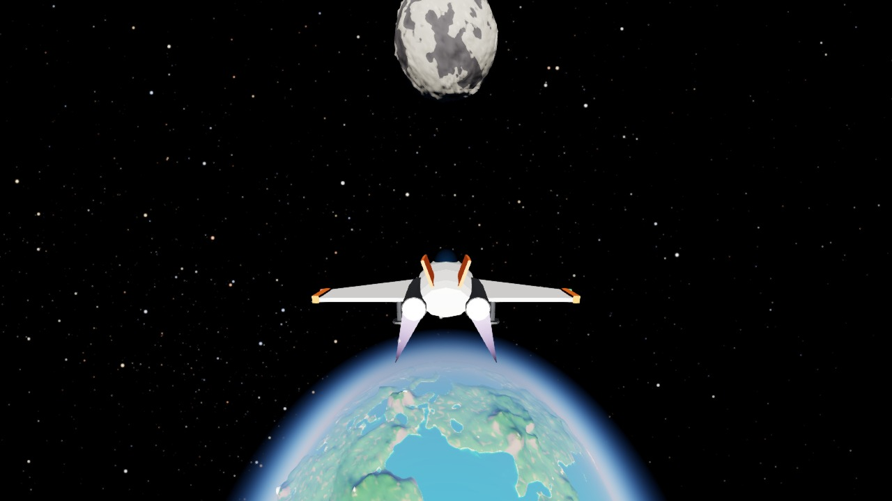

J in space engages the pulse drive: speed = 0.5/s x the distance to the nearest surface, up to
30 km/s. Pointed at a moon, the distance - and with it the speed - shrinks exponentially, so you
arrive instead of crashing; the drive drops out 3 km above the surface. Verdant to Lull, from
the spawn to standing on Lull, takes about a minute.
